## Giới thiệu:
- Môn học: Lập trình WWW (Java)
- Chủ đề: Bài tập tuần 01
   

## Đề bài:
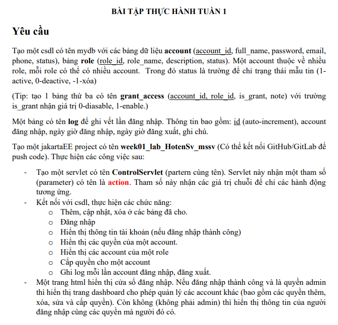
 

## Bài làm:
<b>1.Đăng nhập</b>
  - Form đăng nhập
    
  - Khi nhập sai tài khoản hoặc mật khẩu : thông báo sai tài khoản hoặc mật khẩu và vẫn giữ lại giá trị tại các ô nhập liệu
    
  - Đăng nhập thành công với role ADMIN
    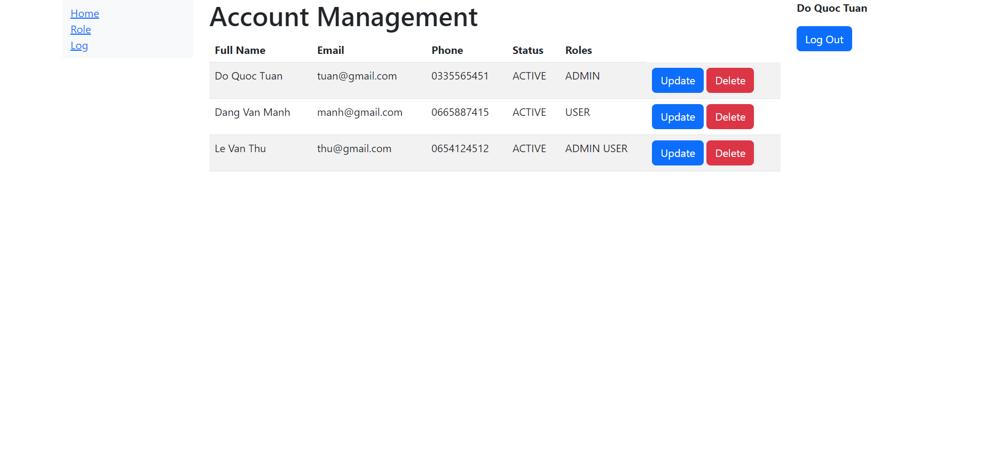
  - Đăng nhập thành công với role USER
    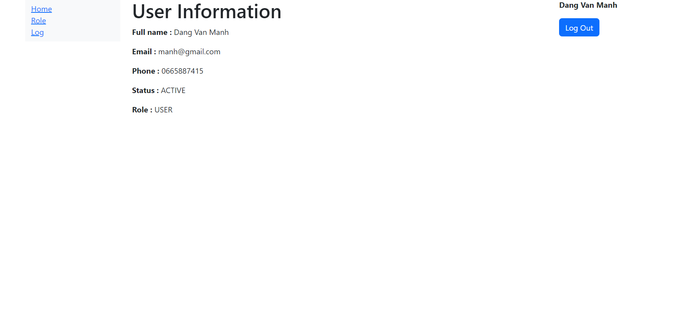
<b>2.Đăng ký hoặc thêm tài khoản</b>
  - Form đăng ký
    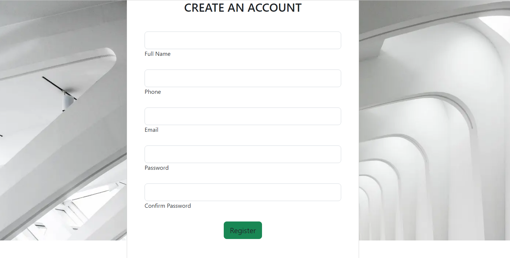
  - Khi sai thông tin đăng ký: thông báo lỗi và vẫn giữ lại giá trị tại các ô nhập liệu
    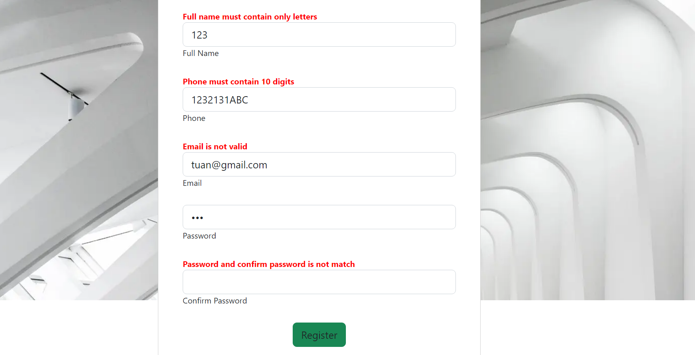
  - Đăng ký thành công sẽ chuyển đến trang đăng nhập
   
<b>3.Sửa ,xóa account</b>
 
  - Trước khi sửa (Dang Van Manh)
    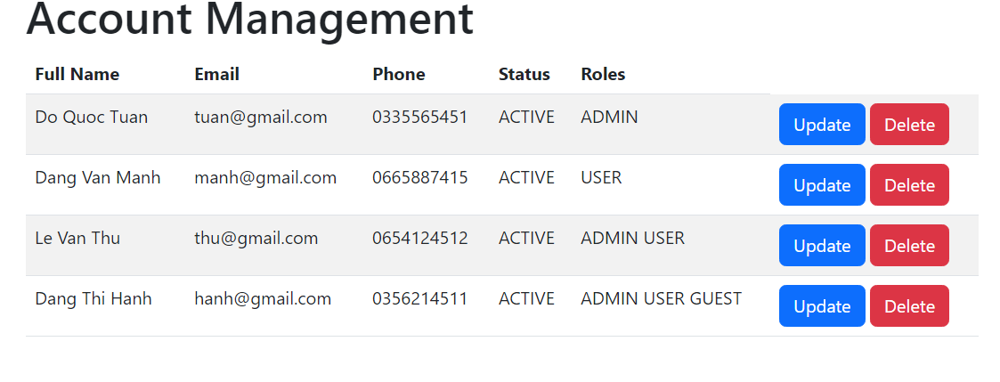
  - Form sửa
    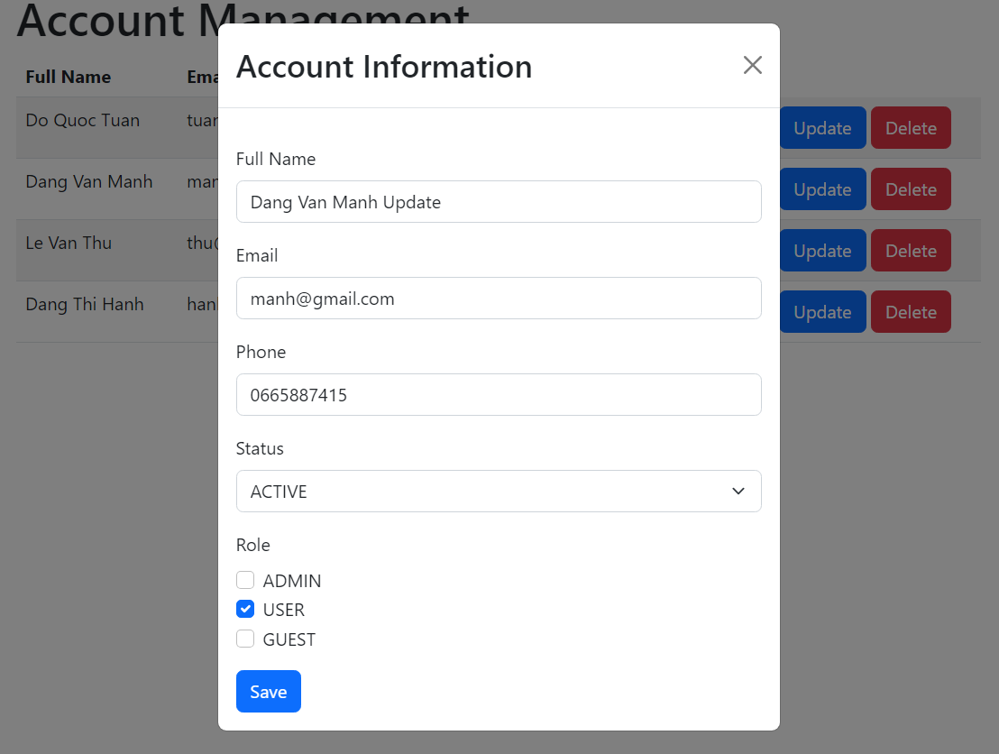
  - Sau khi sửa
    
  - Trước khi xóa (Dang Thi Hanh)
    
  - Xác nhận xóa
    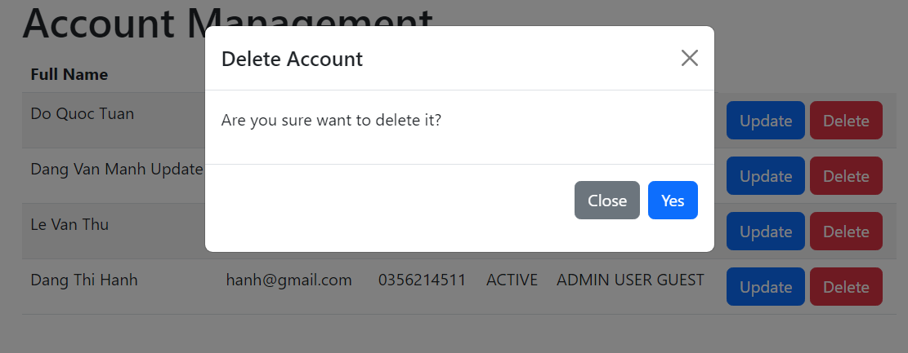
  - Sau khi xóa
    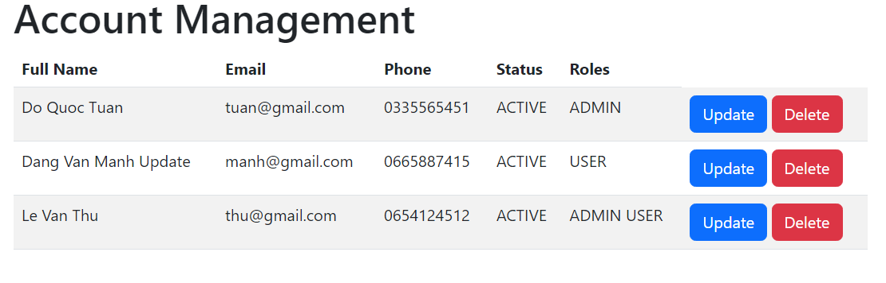
<b>4.Hiển thị quyền và cấp quyền cho account</b>
  - Hiển thị quyền của account : các quyền của 1 account được hiển thị ở cột roles
    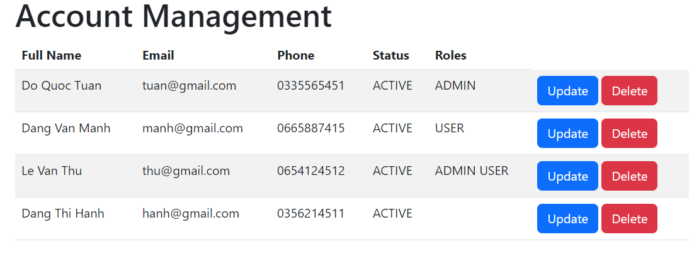
  - Cấp quyền cho account : tích vào các quyền muốn cấp và lưu
    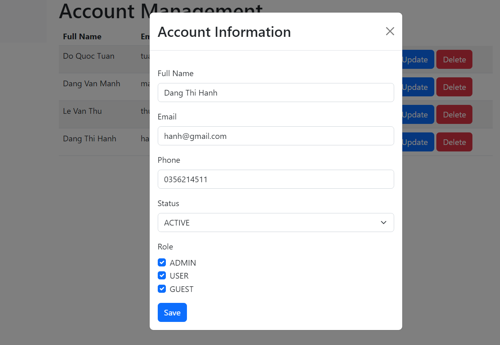
  - Cấp quyền thành công
    
<b>5.Hiển thị các account của 1 role</b>
 
  - Role ADMIN
    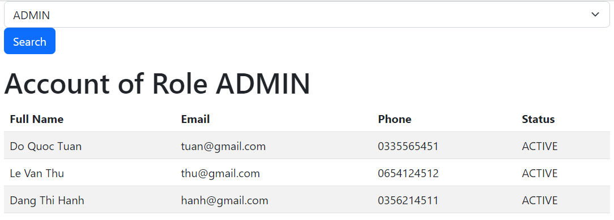
  - Role USER
    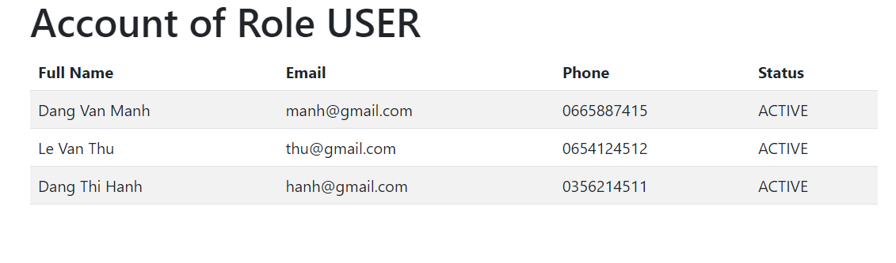
<b>6.Ghi log mỗi lần account đăng nhập,đăng xuất</b>
  - Đăng nhập sẽ có Login Time và Trạng Thái Online
    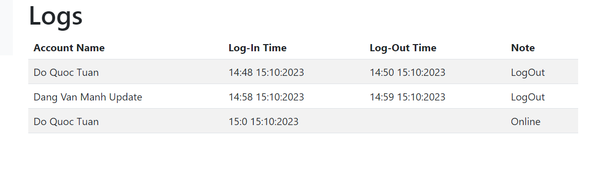
  - Đăng xuất sẽ có Logout Time và Trạng Thái Logout
    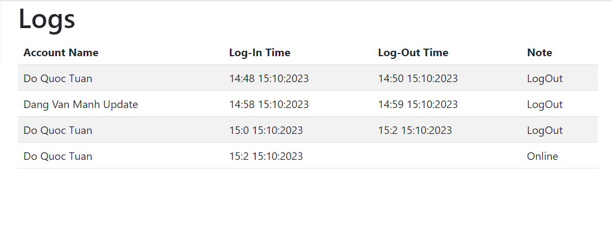
